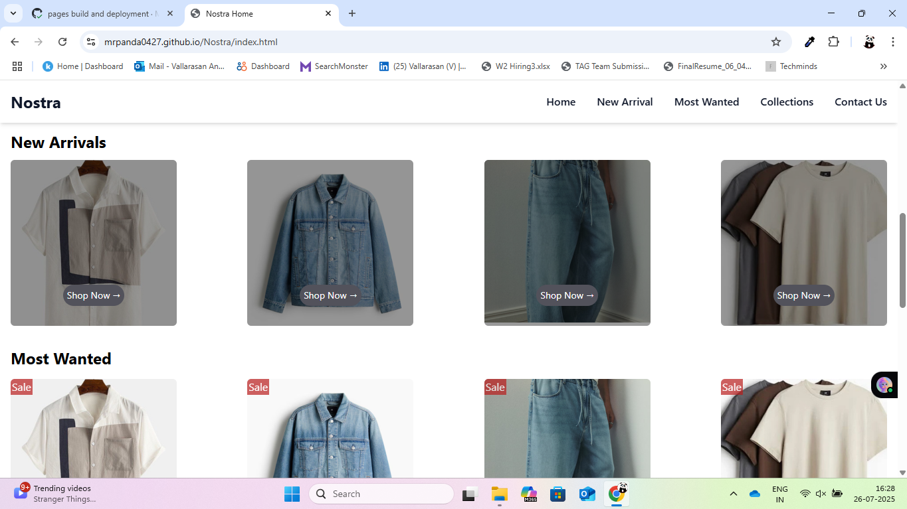
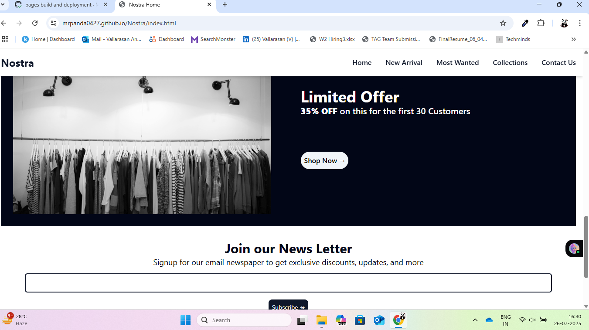
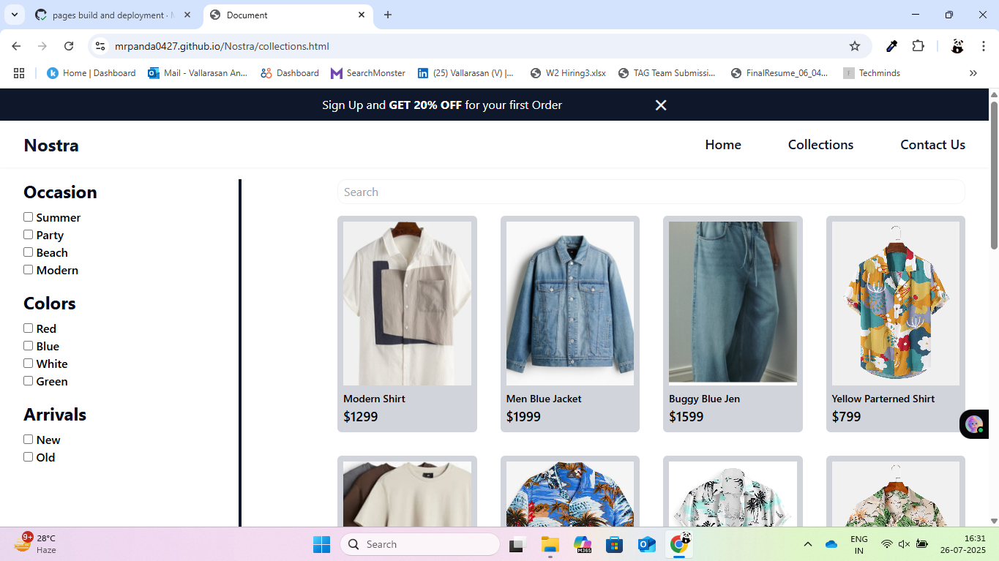
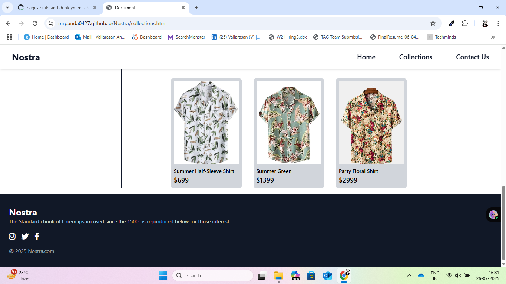
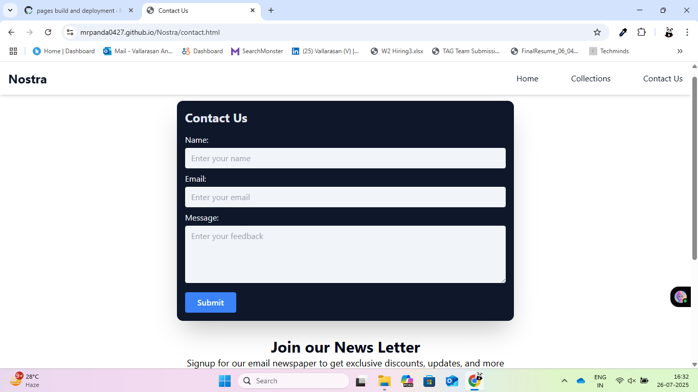

# 🛍️ Nostra – Trendy Shopping Website

  
[🔗 View Site](https://mrpanda0427.github.io/Nostra/)

Nostra is a modern, responsive shopping website built with **HTML**, **Tailwind CSS**, and **JavaScript**. It includes an elegant layout, product filtering, side navigation, banner sliders, and form validation — making it a great starting point for any eCommerce or frontend project.

---

## 🚀 Features

- 🔍 Product filtering using checkboxes
- 📦 Responsive product card layout
- 🧭 Sticky navigation bar with hide/show offer bar
- 📱 Side navigation menu with overlay
- 🎞️ Image carousel/slider
- 📬 Contact form with validation and visual feedback
- 🧵 Built entirely using Tailwind CSS and custom JavaScript

### ✅ UI Components

- **Offer Bar:** A dismissible sign-up offer bar that adjusts navbar position dynamically.
- **Sticky Navbar:** Becomes fixed once the offer bar scrolls out of view.
- **Side Navigation Menu:** Responsive drawer menu with overlay and close button.
- **Image Slider:** Horizontal slider with previous/next controls.
- **Product Filter:** Filters products dynamically based on tags.
- **Contact Form:** Includes required field checks and feedback alerts.

---

## 🌐 Live Preview

👉 **[Live Demo](https://mrpanda0427.github.io/Nostra/)**

---

## 🛠️ Tech Stack

- **HTML5**
- **Tailwind CSS**
- **JavaScript (Vanilla)**

---

## 📂 Folder Structure (Simplified)

Nostra/
├── index.html
├── collections.html
├── styles/
│ └── style.css
├── js/
│ └── main.js
├── images/
│ └── (all image assets)
└── README.md

---

## 📸 Screenshots

### UI Screenshots:
  
  
  
  
  
  

---

## 🙋‍♂️ Author

**Vallarasan A**  
Frontend Developer | IT Recruiter  
📧 vallarasan.a@techmindsgroup.com  
📱 +91 70947 69951

---

## 📝 License

This project is licensed under the **MIT License**.
